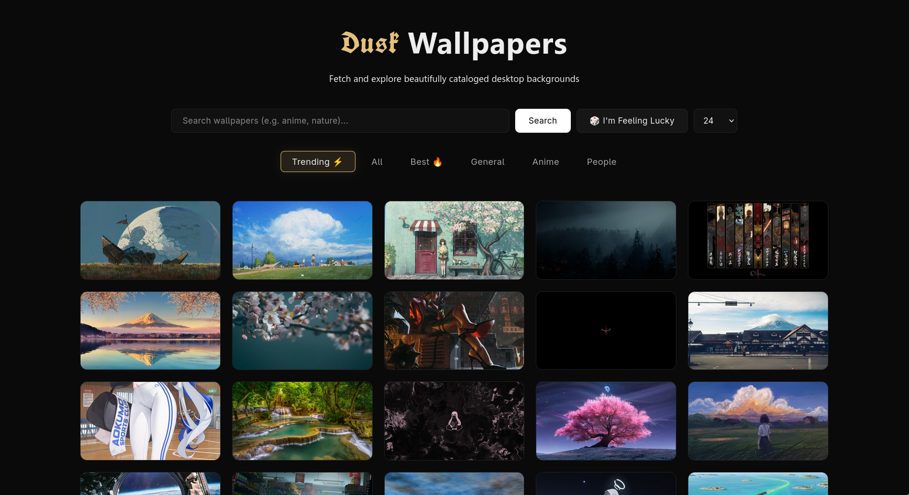

# Dusk >~<

WallHaven Explorer is a small Python project for searching, filtering, and downloading wallpapers from the Wallhaven API. It includes a FastAPI app for browsing results in a web UI and a `Haven` client class for programmatic use.



## What This Project Does

- Search Wallhaven by keyword or random seed.
- Filter results by category, purity, and minimum resolution.
- Fetch multiple pages of results in one call.
- Download the latest search results to a local folder.
- Serve a simple web UI through FastAPI.

## Project Layout

- `src/hapi/hapi.py` - core Wallhaven client and download helpers.
- `src/main.py` - FastAPI app with search endpoints.
- `src/main_example.py` - example script showing how the client can be used.
- `src/views/index.html` - static web UI for browsing wallpapers.
- `src/cli/main.py` - CLI scaffold that is still unfinished.
- `setup.sh` - creates a local virtual environment and installs dependencies.
- `Makefile` - convenience wrapper around the setup script.

## Requirements

- Python 3
- A valid `WALLHAVEN_API_KEY` environment variable
- Internet access for Wallhaven API requests and image downloads

## Setup

1. Set your API key in the environment.

	```bash
	export WALLHAVEN_API_KEY="your_api_key_here"
	```

2. Install dependencies.

	```bash
	make
	```

	This creates a virtual environment in `src/venv` and installs the packages from `src/requirements.txt`.

## Running The Project

The repository currently has two practical entry points:

- The FastAPI app in `src/main.py`
- The example script in `src/main_example.py`

If you want to run the web app, start it from the `src` directory so the local package imports resolve cleanly.

```bash
cd src && fastapi run ./main.py
```

The example script demonstrates how to search and download wallpapers:

```bash
cd src
python main_example.py
```

## API Endpoints

- `GET /` returns the HTML UI.
- `GET /search?q=<query>&limit=<1-100>` returns search results.
- `GET /imIlucky?limit=<1-100>` returns random results using Wallhaven's seeded search behavior.

## Client Usage

The main class is `Haven`.

```python
from hapi import Haven

haven = Haven()
haven.anime_only()
haven.sfw_only()
images = haven.bulk_search("mountains", 3)
haven.download_latest_result("./wallpapers")
```

Useful methods exposed by the client include:

- `search(query, page)`
- `bulk_search(query, pages)`
- `search_trending(query, page, top_range)`
- `bulk_search_trending(query, pages, top_range)`
- `set_min_resolution(width, height)`
- `set_resolution(width, height)`
- `anime_only()`, `people_only()`, `generale_only()`, `accept_all()`
- `sfw_only()`, `nsfw_only()`, `sketchy_only()`, `accept_all_purities()`
- `download_latest_result(download_path)`

## Current Gaps

- The CLI in `src/cli/main.py` is still a placeholder.
- `main_example.py` is useful as a demo, but it is not yet a polished command-line tool.
- The web UI is functional, but it is intentionally minimal.

## Suggestions To Make It Stand Out More

These are documentation-friendly product ideas only, not code changes:

1. Add a clear project identity beyond "wallpaper search". A strong angle would be "curated wallpaper discovery" with a specific aesthetic or theme.
2. Highlight a unique workflow, such as one-click download presets, automatic tagging, or curated collections by mood, genre, or monitor size.
3. Expose a few showcase use cases in the README, like "build a wallpaper rotation folder", "find anime SFW wallpapers", or "pull trending wallpapers for a dual-monitor setup".
4. Add screenshots or a short GIF of the UI in action. For a visual project like this, that will do more than extra prose.
5. Document the best defaults and presets so first-time users immediately get good results without reading the source.
6. If you want the project to feel more polished, a public roadmap or changelog would help signal momentum and intent.

## Notes

- The project expects `WALLHAVEN_API_KEY` to be set before any search runs.
- Downloads use the last search results stored in memory by the client.
- The current code uses simple synchronous requests, which keeps it easy to understand but not especially feature-rich yet.
